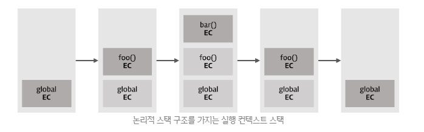

# 실행컨텍스트

Created By: 홍익 안
Last Edited: Nov 21, 2020 3:43 PM

## 1. 실행 컨텍스트(Excecution Context(EC))

실행 컨텍스트는 코드가 실행되기 위해 필요한 환경 이라고 말할 수 있다.  

일반적으로 실행 가능한 코드는 전역 코드와 함수 내 코드이다.

자바스크립트 엔진은 코드를 실행하기 위하여 실행에 필요한 여러가지 정보를 알고 있어야 한다.

- 변수: 전역변수, 지역변수, 매개변수, 객체의 프로퍼티
- 함수 선언
- 변수의 유효범위(Scope)
- this

이와 같이 실행에 필요한 정보를 형상화하고 구분하기 위해 자바스크립트 엔진은 실행 컨텍스트를 물리적 객체의 형태로 관리한다.

```jsx
var x = 'xxx';

function foo () {
  var y = 'yyy';

  function bar () {
    var z = 'zzz';
    console.log(x + y + z);
  }
  bar();
}
foo();
```

위 코드를 실행하면 아래와 같이 실행 컨텍스트 스택이 생성하고 소멸한다. 현재 실행 중인 컨텍스트에서 이 컨텍스트와 관련없는 코드(예를 들어 다른 함수)가 실행되면 새로운 컨텍스트가 생성된다. 이 컨텍스트는 스택에 쌓이게 되고 컨트롤(제어권)이 이동한다.



1. 컨트롤이 실행 가능한 코드로 이동하면 논리적 스택 구조를 가지는 새로운 실행 컨텍스트 스택이 생성된다.
2. 전역 코드(Global code)로 컨트롤이 진입하면 전역 실행 컨텍스트가 생성되고(global EC) 실행 컨텍스트 스택에 쌓인다. global EC는 애플리케이션이 종료될 때(웹페이지에서 나가거나 브라우저를 닫을 때)까지 유지된다.
3. 함수를 호출하면 해당 함수의 실행 컨텍스트가 생성되며 직전에 실행된 코드 블록의 실행 컨텍스트 위에 쌓인다.
4. 함수 실행이 끝나면 해당 함수의 실행 컨텍스트를 파기하고 직전의 실행 컨텍스트에 컨트롤을 반환한다.

## 2. 실행 컨텍스트의 3가지 객체

실행 컨텍스트는 실행 가능한 코드를 형상화하고 구분하는 추상적인 개념이지만 물리적으로는 객체의 형태를 가지며 아래 3가지 프로퍼티를 소유한다.


### 2.1 Variable object(VO/변수객체)

실행 컨텍스트가 생성되면 자바스크립트 엔진은 실행에 필요한 여러 정보들을 담을 객체를 생성한다. 이를 Variable Object(변수 객체)라고 한다. Variable Object는 코드가 실행될 때 엔진에 의해 참조되며 코드에서는 접근할 수 없다.

Variable Object는 아래의 정보를 담는 객체이다

- 변수
- 매개변수(parameter)와 인수 정보(arguments)
(매개변수는 함수 등에서 사용되는 전달된 값을 받는 변수이고, 인수는 값, 변수, 참조 등 전달되는 값을 의미한다)
- 함수 선언(함수 표현식은 제외)

Variable Object는 실행 컨텍스트의 프로퍼티이기 때문에 값을 갖는데 이 값은 다른 객체를 가리킨다. 그런데 **전역 코드 실행시 생성되는 전역 컨텍스트**의 경우와 **함수를 실행할때 생성되는 함수 컨텍스트**의 경우, 가리키는 객체가 다르다. 이는 전역 코드와 함수의 내용이 다르기 때문이다. 예를 들어 전역 코드에는 매개변수가 없지만 함수에는 매개변수가 있다.

Variable Object가 가리키는 객체는 아래와 같다.

**전역 컨텍스트의 경우**
Variable Object는 **전역 객체(Global Object)**를 가리킨다(유일하며 최상위에 위치하고 모든 전역 변수, 전역 함수 등을 포함)  전역 객체는 전역 변수와 전역 함수를 프로퍼티로 소유한다.


**함수 컨텍스트의 경우**
Variable Object는 **활성 객체(Activation Object)**를 가리키며 매개변수와 인수들의 정보를 배열의 형태로 담고 있는 객체인 arguments object가 추가된다.


### 2.2 Scope Chain(SC)

스코프 체인은 해당 EC(전역 또는 함수)가 참조할 수 있는 전역 객체(GO) 또는 활성 객체(AO)의 리스트를 가리킨다.(변수, 함수 선언 등의 정보를 담고 있는) 


**스코프 체인은 식별자 중에서 객체(전역 객체 제외)의 프로퍼티가 아닌 식별자, 즉 변수를 검색하는 메커니즘이다.** 
식별자 중에서 변수가 아닌 객체의 프로퍼티(물론 메소드도 포함)를 검색하는 메커니즘은 프로토타입 체인(Prototype Chaing)이다.

엔진은 스코프 체인을 통해 렉시컬 스코프를 파악한다. 함수가 중첩 상태일 때 하위함수 내에서 상위함수의 스코프와 전역 스코프까지 참조할 수 있는데 이것은 스코프 체인의 검색을 통해 가능하다. 함수가 중첩되어 있으면 중첩될 때마다 부모 함수의 Scope가 자식 함수의 스코프 체인에 포함된다. **함수 실행중에 변수를 만나면 그 변수를 우선 현재 스코프, 즉 Activation Object에서 검색해보고, 만약 검색에 실패하면 스코프 체인에 담겨진 순서대로 그 검색을 이어가게 되는 것**이다. 이것이 스코프 체인이라고 불리는 이유이다.

예를 들어 함수 내의 코드에서 변수를 참조하면 엔진은 스코프 체인의 첫번째 리스트가 가리키는 AO에 접근하여 변수를 검색한다. 만일 검색에 실패하면 다음 리스트가 가리키는 AO 또는 GO를 검색한다. 이와 같이 순차적으로 스코프 체인에서 변수를 검색하는데 결국 검색에 실패하면 정의되지 않은 변수에 접근하는 것으로 판단하여 Reference 에러를 발생시킨다. **스코프 체인은 함수의 프로퍼티인 [[Scope]]로 참조할 수 있다.**


### 2.2 this value

this 프로퍼티에는 this값이 할당된다. this에 할당되는 값은 함수 호출 패턴에 의해 결정된다.

## 3. 실행 컨텍스트의 생성 과정

앞에서 살펴본 아래의 코드를 가지고 실제로 어떻게 실행 컨텍스트가 생성되는지 알아보자.

```jsx
var x = 'xxx';

function foo () {
  var y = 'yyy';

  function bar () {
    var z = 'zzz';
    console.log(x + y + z);
  }
  bar();
}

foo();
```

### 3.1 전역 코드 진입

컨트롤이 실행 컨텍스트에 진입하기 이전에 유일한 전역 객체(Global Object)가 생성된다. 전역 객체는 단일 사본으로 존재하며 이 객체의 프로퍼티는 코드의 어떠한 곳에서도 접근할 수 있다. 초기 상태의 전역 객체에는 빌트인 객체(Math, String, Array 등)와 BOM, DOM이 설정되어 있다.


전역 객체가 생성된 이후, 전역 코드로 컨트롤이 진입하면 global EC(전역 실행 컨텍스트)가 생성되고 실행 컨텍스트 스택에 쌓인다


이후 이 실행 컨텍스트를 바탕으로 아래의 처리가 실행된다.

> 1. 스코프 체인의 생성과 초기화
2. Variable Instantiation(변수 객체화) 실행
3. this value 결정

### 3.1.1 스코프 체인의 생성과 초기화

실행 컨텍스트가 생성된 이후 가장 먼저 스코프 체인의 생성과 초기화가 실행된다. 이때 스코프 체인은 전역 객체의 레퍼런스를 포함하는 리스트가 된다.


### 3.1.2 Variable Instantiation(변수 객체화) 실행

스코프 체인의 생성과 초기화가 종료하면 변수 객체화(Variable Instantiation)가 실행된다.

**변수 객체화(Variable Instantiation)는 Variable Object에 프로퍼티와 값을 추가하는 것을 의미**한다. 변수 객체화라고 번역하기도 하는데 이는 변수, 매개변수와 인수 정보(arguments), 함수 선언을 Variable Object에 추가하여 객체화하기 때문이다.

전역 코드의 경우, Variable Object는 Global Object를 가리킨다.


**Variable Instantiation(변수 객체화)는 아래의 순서로 Variable Object에 프로퍼티와 값을 set한다. 
(반드시 1→2→3 순서로 실행된다.)**

> 1. (Function Code인 경우) 매개변수(parameter)가 Variable Object의 프로퍼티로, 인수(arguments)가 값으로 생성된다.
2. 대상 코드 내의 함수 선언(함수 표현식 제외)을 대상으로 함수명이 Variable Object의 프로퍼티로, 생성된 함수 객체가 값으로 설정된다.(함수 호이스팅)
3. 대상 코드 내의 변수 선언을 대상으로 변수명이 Variable Object의 프로퍼티로, undefined가 값으로 설정된다(변수 호이스팅)

위 예제 코드를 보면 전역 코드에 변수 x와 함수 foo(매개변수 없음)가 선언되었다. Variable Instantiation의 실행 순서 상, 우선 2번의 함수 foo선언이 처리되고(함수가 아닌 전역 코드기 때문에 1번은 실행되지 않는다) 그 후 3번의 변수 x선언이 처리된다.

### 3.1.2.1 함수 foo의 선언 처리

함수 선언은 Variable Instantiation 실행 순서 2번과 같이 선언된 함수명 foo가 Variable Object(전역 코드인 경우 Global Object)의 프로퍼티로, 생성된 함수 객체가 값으로 설정된다.


생성된 함수 객체는 [[Scopes]] 프로퍼티를 가지게 된다. **[[Scopes]] 프로퍼티는 함수 객체만이 소유하는 내부 프로퍼티(Internal Property)로서 함수 객체가 실행되는 환경**을 가리킨다. 따라서 현재 실행 컨텍스트의 스코프 체인이 참조하고 있는 객체를 값으로 설정한다. 내부 함수의 [[Scopes]] 프로퍼티는 자신의 실행 환경(Lexical Enviroment)과 자신을 포함하는 외부 함수의 실행 환경과 전역 객체를 가리키는데 이때 자신을 포함하는 외부 함수의 실행 컨텍스트가 소멸하여도 [[Scopes]] 프로퍼티가 가리키는 외부 함수의 실행 환경(Activation object)은 소멸하지 않고 참조할 수 있다. 이것이 클로저이다.


지금까지 살펴본 실행 컨텍스트는 아직 코드가 실행되기 이전이다. 하지만 스코프 체인이 가리키는 변수 객체(VO)에 이미 함수가 등록되어 있으므로 이후 코드를 실행할 때 함수선언식 이전에 함수를 호출할 수 있게 되었다.

이때 알 수 있는 것은 **함수선언식의 경우, 변수 객체(VO)에 함수표현식과 동일하게 함수명을 프로퍼티로 함수 객체를 할당한다는 것이다. 단, 함수선언식은 변수 객체(VO)에 함수명을 프로퍼티로 추가하고 즉시 함수 객체를 할당하지만 함수 표현식은 일반 변수의 방식을 따른다**. **따라서 함수선언식의 경우, 선언문 이전에 함수를 호출할 수 있다. 이러한 현상을 [함수 호이스팅(Function Hoisting)](https://poiemaweb.com/js-function#2-%ED%95%A8%EC%88%98-%ED%98%B8%EC%9D%B4%EC%8A%A4%ED%8C%85function-hoisting)이라 한다.**

참고


### 3.1.2.2 변수 x의 선언 처리

변수 선언은 Variable Instantiation 실행 순서 3.과 같이 선언된 변수명( x )이 Variable Object의 프로퍼티로, undefined가 값으로 설정된다. 이것을 좀더 세분화 해보면 아래와 같다.

**선언 단계(Declaration phase)**

변수 객체(Variable Object)에 변수를 등록한다. 이 변수 객체는 스코프가 참조할 수 있는 대상이 된다.

**초기화 단계(Initialization phase)**

변수 객체(Variable Object)에 등록된 변수를 메모리에 할당한다. 이 단계에서 변수는 undefined로 초기화된다.

**할당 단계(Assignment phase)**

undefined로 초기화된 변수에 실제값을 할당한다.

**var 키워드로 선언된 변수는 선언 단계와 초기화 단계가 한번에 이루어진다.** 다시 말해 스코프 체인이 가리키는 변수 객체에 변수가 등록되고 변수는 undefined로 초기화된다. 따라서 변수 선언문 이전에 변수에 접근하여도 Variable Object에 변수가 존재하기 때문에 에러가 발생하지 않는다. 다만 undefined를 반환한다. 이러한 현상을 **[변수 호이스팅(Variable Hoisting)](https://poiemaweb.com/js-data-type-variable#24-%EB%B3%80%EC%88%98-%ED%98%B8%EC%9D%B4%EC%8A%A4%ED%8C%85variable-hoisting)**이라한다.

**아직 변수 x는 ‘xxx’로 초기화되지 않았다.** 이후 변수 할당문에 도달하면 비로소 값의 할당이 이루어진다.


### 3.1.3 this value 결정

변수 선언 처리가 끝나면 다음은 this value가 결정된다. **this value가 결정되기 이전에 this는 전역 객체를 가리키고 있다가 함수 호출 패턴에 의해 this에 할당되는 값이 결정된다**. 전역 코드의 경우, this는 전역 객체를 가리킨다.


**`전역 컨텍스트(전역 코드)의 경우, Variable Object, 스코프 체인, this 값은 언제나 전역 객체이다.`**

### 3.2 전역 코드의 실행

지금까지는 코드 실행 환경을 갖추기 위한 사전 준비였다. 코드의 실행은 지금부터 시작된다.

```jsx
var x = 'xxx';

function foo () {
  var y = 'yyy';

  function bar () {
    var z = 'zzz';
    console.log(x + y + z);
  }
  bar();
}

foo();
```

위 예제를 보면 전역 변수 x에 문자열 ‘xxx’ 할당과 함수 foo의 호출이 실행된다.

### 3.2.1 변수 값의 할당

전역 변수 x에 문자열 ‘xxx’를 할당할 때, 현재 실행 컨텍스트의 스코프 체인이 참조하고 있는 Variable Object를 선두(0)부터 검색하여 변수명에 해당하는 프로퍼티가 발견되면 값(‘xxx’)을 할당한다.


### 3.2.2 함수 foo의 실행

전역 코드의 함수 foo가 실행되기 시작하면 새로운 함수 실행 컨텍스트가 생성된다. 함수 foo의 실행 컨텍스트로 컨트롤이 이동하면 전역 코드의 경우와 마찬가지로 **1. 스코프 체인의 생성과 초기화**, **2. Variable Instantiation 실행**, **3. this value 결정**이 순차적으로 실행된다.

단, 전역 코드와 다른 점은 이번 실행되는 코드는 함수 코드라는 것이다. 따라서 **1. 스코프 체인의 생성과 초기화**, **2. Variable Instantiation 실행**, **3. this value 결정**은 전역 코드의 룰이 아닌 함수 코드의 룰이 적용된다.


### 3.2.2.1 스코프 체인의 생성과 초기화

함수 코드의 **스코프 체인의 생성과 초기화**는 우선 Activation Object에 대한 레퍼런스를 스코프 체인의 선두에 설정하는 것으로 시작된다.

Activation Object는 우선 **arguments 프로퍼티의 초기화**를 실행하고 그 후, Variable Instantiation가 실행된다. Activation Object는 스펙 상의 개념으로 프로그램이 Activation Object에 직접 접근할 수 없다. (Activation Object의 프로퍼티로의 접근은 가능하다)


그 후, Caller(전역 컨텍스트)의 Scope Chain이 참조하고 있는 객체가 스코프 체인에 push된다. 따라서, 이 경우 함수 foo를 실행한 직후 실행 컨텍스트의 스코프 체인은 Activation Object(함수 foo의 실행으로 만들어진 AO-1)과 전역 객체를 순차적으로 참조하게 된다.

**스코프 체인이 바인딩한 객체가 바로 렉시컬 스코프의 실체이다.**


### 3.2.2.2 Variable Instantiation 실행

Function Code의 경우, **스코프 체인의 생성과 초기화**에서 생성된 Activation Object를 Variable Object로서 Variable Instantiation가 실행된다. 이것을 제외하면 전역 코드의 경우와 같은 처리가 실행된다. 즉, 함수 객체를 Variable Object(AO-1)에 바인딩한다. (프로퍼티는 bar, 값은 새로 생성된 Function Object. bar function object의 [[Scope]] 프로퍼티 값은 AO-1과 Global Object를 참조하는 리스트）


변수 y를 Variable Object(AO-1)에 설정한다 이때 프로퍼티는 y, 값은 undefined이다.

### 3.2.2.3 this value 결정

변수 선언 처리가 끝나면 다음은 this value가 결정된다. [this](https://poiemaweb.com/js-this)에 할당되는 값은 함수 호출 패턴에 의해 결정된다.

내부 함수의 경우, this의 value는 전역 객체이다.


### 3.3 foo 함수 코드의 실행

이제 함수 foo의 코드 블록 내 구문이 실행된다. 위 예제를 보면 변수 y에 문자열 ‘yyy’의 할당과 함수 bar가 실행된다.

### 3.3.1 변수 값의 할당

지역 변수 y에 문자열 ‘yyy’를 할당할 때, 현재 실행 컨텍스트의 스코프 체인이 참조하고 있는 Variable Object를 선두(0)부터 검색하여 변수명에 해당하는 프로퍼티가 발견되면 값 ‘yyy’를 할당한다.


### 3.3.2 함수 bar의 실행

함수 bar가 실행되기 시작하면 새로운 실행 컨텍스트이 생성된다.


이전 함수 foo의 실행 과정과 동일하게 1. 스코프 체인의 생성과 초기화, 2. Variable Instantiation 실행, 3. this value 결정이 순차적으로 실행된다.


이 단계에서 `console.log(x + y + z);` 구문의 실행 결과는 xxxyyyzzz가 된다.

> x : AO-2에서 x 검색 실패 → AO-1에서 x 검색 실패 → GO에서 x 검색 성공 (값은 ‘xxx’)y : AO-2에서 y 검색 실패 → AO-1에서 y 검색 성공 (값은 ‘yyy’)z : AO-2에서 z 검색 성공 (값은 ‘zzz’)

출처:

[Execution Context | PoiemaWeb](https://poiemaweb.com/js-execution-context)