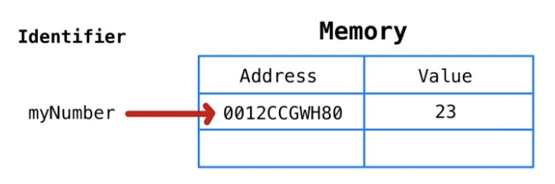

# 자바스크립트의 메모리 모델

Created By: 홍익 안
Last Edited: Nov 28, 2020 4:47 PM

# 1. 원시타입 변수의 선언과 할당

```jsx
let myNumber = 23;
```

이 코드가 실행될때 자바스크립트는 아래의 작업을 수행한다

1. 변수의 고유 식별자 myNumber 생성
2. 메모리에 주소 할당(런타임에 할당됨)
3. 할당된 주소에 값(23) 저장



여기서 myNumber는 23과 동일하다고 말하지만 사실은 23이라는 값이 보관된 위치의 메모리 주소값이다.

새로운 변수를 하나 생성하고 myNumber를 할당한다고 가정해보자

```jsx
let newVar = myNumber;
```

myNumber의 값이 '0012CCGWH80'이기 떄문에 newVar 또한 23을 값으로 가지고 있는 메모리주소 '0012CCGWH80'값이 할당된다


아래의 코드를 실행하면 어떻게 될까?

```jsx
myNumber = myNumber + 1;
```

myNumber의 값은 24가 될것이다. newVar는 어떨까? 같은 메모리 주소를 가리키고 있으니 24로 변경되었을까?

**그렇지 않다.** 자바스크립트에서 primitive data type들은 값의 변경이 불가능(immutable)하므로 'myNumber +1'이 24인 것을 확인하면 자바스크립트는 메모리에 새로운 주소를 할당하고 해당 메모리 주소에 24를 저장한다.

다른 예제를 하나 더 보자

```jsx
let myString = "abc";
myString = myString + "d";
```

초보 자바스크립트 개발자들은 'd'가 단순히 메모리에 존재하는 'abc' 뒤에 추가된다고 생각하지만 그렇지 않다.

자바스크립트의 문자열은 primitive type이기에 이때도 'abcd'를 위한 새로운 메모리 주소가 할당되고, myString은 그곳을 가리키게 된다.

# 2. 콜스택과 힙

자바스크립트의 메모리 모델은 콜스택과 힙 두가지로 명확히 구분되어 있다고 생각해보자


콜스택은 원시타입 데이터가 저장되는 곳이다(함수 호출 또한 이곳에 저장)

변수가 할당된 후 콜스택의 대략적인 모습은 아래와 같다.


위의 그림에서 변수의 값을 보여주기위해 메모리 주소를 생략했지만 실은 변수가 메모리 주소를 가리키고 있다는 사실을 기억해야 한다.

이것은 이후 let과 const를 이해하는데 필수적인 개념이다.

힙에는 원시타입이 아닌 타입들이 저장된다.

힙은 배열과 객체 같은 정렬되지 않은 데이터(동적으로 커질수 있는)들이 저장된다는 것이 키포인트다.

# 3. 참조 타입 변수의 선언과 할당

자바스크립트의 참조 타입은 원시타입과 다르게 동작한다.

간단한 예를 살펴보자

```jsx
let myArray = [];
```

'myArray' 변수를 선언하고 '[]'과 같은 참조타입을 할당했을때 메모리에서 일어나는 일은 다음과 같다.

1. 변수의 고유 식별자 생성('myArray')
2. 콜스택에 주소를 할당(런타임에 할당)
3. 힙에 할당된 메모리의 주소를 콜스택 주소의 값으로 저장(런타임에 할당)
4. 힙의 메모리 주소에 할당된 값( 빈 배열 []) 저장


배열에 아래와 같은 작업을 한다고 가정해보자

```jsx
myArray.push("first");
myArray.push("second");
myArray.push("third");
myArray.push("fourth");
myArray.pop();
```


배열에 push로 할당한 값들은 힙에 저장되는 것을 볼 수 있다

# 4. let과 const

일반적으로 우리는 가능한한 const를 사용해야하고 변수가 변경될 것이라는 것을 알고있을때만 let을 사용해야한다.

여기서 변경이란것이 어떤 의미를 가지는지 짚어보자.

흔한 오해는 '변경'의 의미를 값의 변화로 해석하는 것이다. 이렇게 해석하는 자바스크립트 개발자들은 다음과 같은 코드를 작성할 수 있다.

```jsx
let sum = 0;
sum = 1 + 2 + 3 + 4 + 5;
let numbers = [];
numbers.push(1);
numbers.push(2);
numbers.push(3);
numbers.push(4);
numbers.push(5);
```

이 개발자는 sum값이 변경될 것임을 알았기 때문에 let키워드를 사용해서 sum을 선언했다.(correct)

그러나 numbers를 선언할때, 배열에 push를 사용해 값을 넣는 행위를 '값의 변경'으로 해석해서 let으로 선언했다.(incorrect)

여기서 '변경'의 올바른 해석은 메모리 주소의 변경을 의미한다.

메모리 주소를 변경한다고 가정해보자. const는 메모리 주소를 바꾸는 것을 허용하지 않는다.

```jsx
const importantID = 489;
importantID = 100; // TypeError: Assignment to constant variable
```

importantID가 선언되면 메모리 주소가 할당되고 그곳에 저장된 값은 489이다. 변수 importantID는 메모리 주소와 같다는 점을 기억해야한다.


100 이라는 값이 importantID에 할당될때 이 값은 원시타입이므로 새로운 주소가 할당되고 100은 그곳에 저장된다. 이후 새롭게 생성된 주소값을 importantID가 가리키는데 이곳이 에러가 발생하는 부분이다.

const를 사용해서 ID값이 바뀌지 않기를 원했으므로 위 상황은 우리의 의도대로 동작한 것이다.


위에서 언급한 것처럼 초보 자바스크립트 개발자는 let을 사용해서 배열을 잘못 선언했다.

그들은 const를 사용했어야 한다. 이는 직관적이지 않아서 혼란스러울 수 있다.

'배열은 변경 가능할때만 유용한데 그것을 const로 선언해서 바꿀 수 없게 만든다면 그것을 왜 사용해야하는가?'

라고 생각할 수 있다.

그러나 '변경'이란 메모리 주소에의해 정의된다는걸 다시 기억해야한다.

배열을 const로 선언하는 것이 왜 괜찮고 좋은지 살펴보자

```jsx
const myArray = [];
```

myArray변수가 선언될때 메모리 주소가 콜스택에 할당되고, 해당 메모리주소의 값은 힙에 할당된 메모리 주소이다. 실제 힙에 저장된 값은 빈 배열이다.


아래와 같은 코드를 작성한다면

```jsx
myArray.push(1);
myArray.push(2);
myArray.push(3);
myArray.push(4);
myArray.push(5);
```


push를 통해 넣은 number들은 힙에 위치한 배열에 들어가게 된다. **그러나 myArray의 메모리 주소는 변경되지 않는다. 이것이 myArray 변수가 const로 선언되었음에도 에러가 발생하지 않은 이유이다.**

myArray는 여전히 '0458AFCZX91'위치를 가리키고 있고 배열의 값들이 저장되어있는 힙의 주소인 '22VVCX011'를 값으로 가지고 있다.

아래와 같은 작업을 하면 에러가 발생할 것이다.

```jsx
myArray = 3;
```

3이란 값은 원시값이고 콜스택의 새로운 주소에 할당되어 값으로 저장될것이다. 이때 우리는 새로운 주소를 const로 선언된 myArray가 가리키도록 변경하길 원하므로 에러가 발생한다.


오류가 발생하는 또다른 예를 보자

```jsx
myArray = ["a"];
```

['a']는 참조타입인 배열이므로 콜스택에 새로운 메모리 주소가 할당되고, 힙의 주소가 값으로 할당될 것이다.

해당 힙 주소의 값에는 ['a']가 들어있다. 이후 myArray에 새로운 콜스택 주소를 할당하려고 하면 오류가 발생한다.


const로 선언한 객체의 경우에도 참조타입이므로 키값을 추가하거나 값을 업데이트 하는 등 변경할 수 있다.

```jsx
const myObj = {};
myObj["newKey"] = "someValue"; // this will not throw an error
```

구글의 자바스크립트 가이드에는 다음과 같은 내용이 있다.

- 모든 지역 변수를 const 또는 let으로 선언해라
- 변수를 재할당 하지 않는한 기본적으로 const를 사용해라
- var은 절대 사용하지 마라

이렇게 말하는 이유는 몇가지가 있는데,

1. 버그의 사전 방지
2. const로 선언된 변수는 선언과 동시에 초기화 되어야 하므로 개발자는 스코프 측면에서 신중하게 변수를 배치해야함을 강요받게 된다. 이것은 더 나은 메모리 관리와 성능의 향상으로 이어지게 된다.
3. 어떤 변수가 변경할수 없는 변수인지, 재할당 가능한 변수인지 코드를 보는 것만으로도 알수 있다

출처:

[JavaScript's Memory Model](https://medium.com/@ethannam/javascripts-memory-model-7c972cd2c239)
