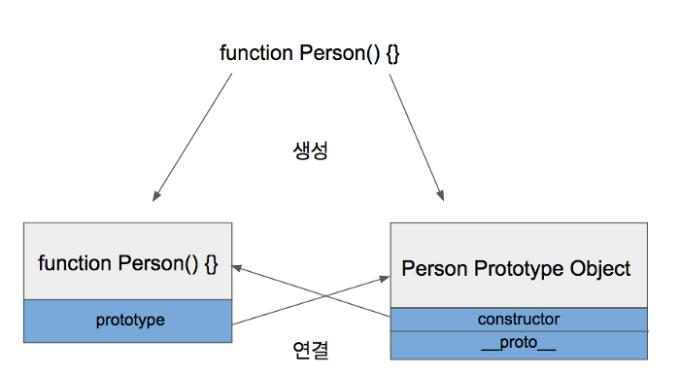

# Prototype

Created By: 홍익 안
Last Edited: Nov 18, 2020 2:41 PM

## Prototype

자바스크립트는 기존의 객체를 복사하여(cloning) 새로운 객체를 생성하는 프로토타입 기반의 언어이다. 프로토타입 기반 언어는 객체의 원형인 프로토타입을 이용하여 새로운 객체를 만들어낸다. 이렇게 생성된 객체 역시 또 다른 객체의 원형이 될 수 있다. 프로토타입은 객체를 확장하고 객체 지향적인 프로그래밍을 할 수 있게 해준다.

JavaScript에서는 기본 데이터 타입인 boolean, number, string, 그리고 특별한 값인 null, undefined 빼고는 모두 객체이다. 사용자가 정의한 함수도 객체이고, new라는 연산자를 통해 생성된 것도 객체이다.

뒤에서 자세히 나오지만 객체 안에는 `__proto__`속성이 존재하는데, 이 속성은 객체가 만들어지기 위해 사용된 원형인 Prototype Object를 숨은 링크로 참조하는 역할을 합니다.

## Prototype Link & Prototype Object

자바스크립트에는 위의 두가지를 통틀어 Prototype이라고 부른다.

## Prototype Object

자바스크립트에서 객체는 언제나 함수(Function)를 사용해 생성된다

```jsx
function Person() {} // => 함수

var personObject = new Person(); // => 함수로 객체를 생성
```

```jsx
var obj = {}; //1
var obj = new Object();//2
```

1번 코드는 함수와 전혀 상관없는 코드같지만 사실은 2번코드와 같다.

`Object`는 자바스크립트에서 기본적으로 제공되는 `함수`이다.

`Object`와 마찬가지로 `Function`, `Array`도 모두 함수로 정의되어 있다.

### 함수가 정의될때 일어나는 일?

### 1. 해당 함수에 Constructor(생성자) 자격 부여

- Constructor 자격이 부여되면 new를 통해 객체를 만들어 낼 수 있게 되는데, 이것이 함수만 new 키워드를 사용할 수 있는 이유이다.

### 2. 해당 함수의 Prototype Object 생성 및 연결

- 함수를 정의하면 함수만 생성되는 것이 아니라 Prototype Object도 같이 생성된다.
- 여기서 생성되는 **Prototype Object는 이후에 new라는 연산자와 함수(ex: Person)를 통해 생성된 모든 객체의 원형이 되는 객체**이다.(이를 통해 생성된 모든 객체가 참조한다는 것을 기억해야 한다)
- 모든 객체는 Prototype Object에 접근할 수 있다.



이렇게 생성된 함수는 prototype이라는 속성을 통해 Prototype Object에 접근할 수 있다. Prototype Object는 일반적인 객체와 같으며 기본 속성으로 `constructor`와 `__proto__`를 가지고 있다.


여기서 `constructor`는 Prototype Object와 함께 생성되었던 함수를 가리키고 있고, `__proto__`는 Prototype Link를 가리키는데 이것에 대해서는 아래에 작성할 예정.

Prototype Object는 일반적인 객체이므로 속성을 마음대로 추가/삭제 할 수 있다.

```jsx
function Person() {}
Person.prototype.eyes = 2;
Person.prototype.nose = 1;
var kim  = new Person();
var park = new Person():
console.log(kim.eyes); // => 2
```


## Prototype Link


위의 예제에서 kim객체에는 eyes라는 속성이 없는데 kim.eyes에 어떻게 접근한 것일까? 이것에 대한 해답은 kim객체가 가지고있는 속성 `__proto__`에 있다.

`prototype`(≠`__proto__`)이라는 속성은 함수만이 가지고 있다. (위의 예제에서 Person.prototype으로 접근했었다.) 하지만 `__proto__`속성은 모든 객체가 빠짐없이 가지고 있는 속성이다.

`__proto__`는 **객체가 생성될 때 객체 자신을 생성해준 함수의 Prototype Object를 가리킨다!.** kim객체는 Person함수로부터 생성되었으니 kim 객체의 `__proto__`는 **Person 함수의 Prototype Object를 가리키고 있는 것이다.**


kim객체는 eyes를 직접 가지고 있지 않기 때문에 eyes 속성을 찾을 때까지 상위 프로토타입을 탐색한다. **최상위인 Object의 Prototype Object까지 도달했는데도 찾지 못한 경우**에 `undefined`를 리턴한다. 이렇게 `__proto__`속성을 통해 상위 프로토타입과 연결되어 있는 형태를 `프로토타입 체인(Chain)`이라고 한다.


이러한 프로토타입 체인 구조 떄문에 모든 객체는 Object의 자식이라고 불리고, Object Prototype Object에 있는 모든 속성을 사용할 수 있는 것이다. 한가지 예로 toString함수가 있다.


참고

```jsx
function Person(){}

var joon = new Person();  
var jisoo = new Person();

Person.prototype.getType = function (){  
    return "인간"; 
};

console.log(joon.getType());   // 인간
console.log(jisoo.getType());  // 인간
joon.getType = function (){  
    return "사람"; 
};

console.log(joon.getType());   // 사람
console.log(jisoo.getType());  // 인간

jisoo.age = 25;

console.log(joon.age);   // undefined
console.log(jisoo.age);  // 25

Person.prototype.getType = function (){  
    return "사람"; 
};

console.log(jisoo.getType());  // 사람
```


출처:

[[Javascript ] 프로토타입 이해하기](https://medium.com/@bluesh55/javascript-prototype-%EC%9D%B4%ED%95%B4%ED%95%98%EA%B8%B0-f8e67c286b67)

[JavaScript : 프로토타입(prototype) 이해](http://www.nextree.co.kr/p7323/)

[Javascript 기초 - Object prototype 이해하기](http://insanehong.kr/post/javascript-prototype/)